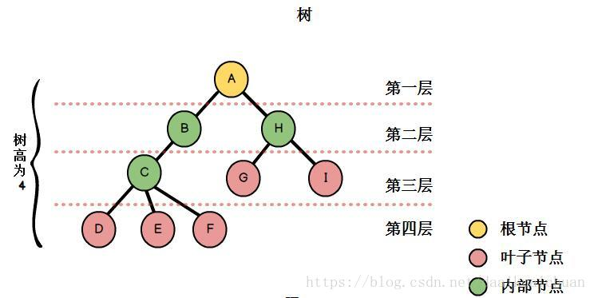
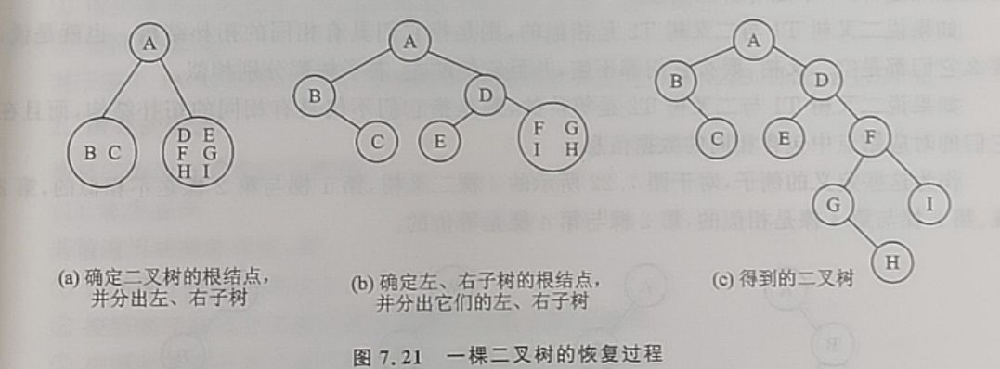
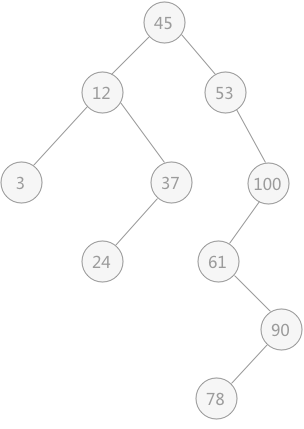

# 数据结构与算法简述与综合

数据结构与算法简述与自整理。本文非基础的教程，本文会列出大量学习和参考网站。

数据结构 + 算法 = 程序。数据结构：现实问题的符合计算机存储的建模；算法：解决现实问题的步骤（符合有穷性，确定性，可行性等）。

------

## IT 学习路线

1. C语言基础 →
2. C语言三剑客：《C和指针》、《C陷阱与缺陷》和《C专家编程》 →
3. 数据结构与算法（顺序表/树/图 + 排序/搜索/规划等等等 按需学） →
4. 计算机专业科学看的《计算机体系结构》，《计算机操作系统》/《现代操作系统》/《深入理解计算机系统》，《编译原理》，网络协议如《计算机网络》、《TCP-IP详解卷一/卷二/卷三》等，《深入分析GCC》等 →
5. 可选 《CPU自制入门》 →
6. 走向：嵌入式 Linux 方向、FPGA / 芯片设计方向、具体某算法方向等等。

更多学习路线可详细参考 [rd2coding/Road2Coding: 编程之路 (github.com)](https://github.com/rd2coding/Road2Coding) 的总结，比较全面了。

## 相关坚韧大厚书

- [哪本《数据结构与算法》最好？ - 知乎 (zhihu.com)](https://www.zhihu.com/question/21628833) 该回答列举了一些不错的数据结构与算法方面的书籍。
- 《算法导论》（经典）是计算机学科的算法入门书。
- 《编码的奥秘》，相关介绍/推荐 [想练习《编码的奥秘》里面的知识，有什么软件有帮助？ - 知乎 (zhihu.com)](https://www.zhihu.com/question/28223767)。
- 《计算机体系结构》（经典），《计算机操作系统》/《现代操作系统》/《深入理解计算机系统》，《编译原理》（经典）。
- 网络协议如《计算机网络》、《TCP-IP详解卷一/卷二/卷三》，[ 想深入了解 HTTP 协议，有哪些值得推荐的书籍？ - 知乎 (zhihu.com)](https://www.zhihu.com/question/19722062)。
- 《深入分析GCC》。
- 嵌入式应用相关：《GUN Make》，《Debugging with GDB》，《Linux 高级程序开发》，《POSIX 多线程程序设计》，《嵌入式Linux基础教程》，《嵌入式Linxu应用开发完全手册》，《嵌入式Linxu应用程序开发详解》。
- 嵌入式底层相关：内核相关：《深入理解Linux内核》，《Linux内核源代码情景分析》，《Linux内核设计与实现》；驱动相关：《Linux设备驱动程序》，《Linux设备驱动开发详解》，《Linux驱动开发入门与实践》。

## 相关有趣/耐看书

- 《算法新解》开源书。
- 图解系统 小林。图解网络 小林。
- 趣谈网络协议。
- 手绘图解HTTP。30张图解HTTP常见面试题。
- [TCP/IP 教程 | 菜鸟教程 (runoob.com)](https://www.runoob.com/tcpip/tcpip-tutorial.html)。[HTTP 教程 | 菜鸟教程 (runoob.com)](https://www.runoob.com/http/http-tutorial.html)。

## 时间、空间复杂度

时间复杂度表示一个算法内执行语句的数量在最坏的情况下随着循环次数 n 的增加而增长的数量级。一个算法内语句的使用次数（频度）表示为 f(n)，n 为算法内循环语句的循环数，n 的变化直接改变 整个算法的语句使用次数；时间复杂度 O(g(n)) 的定义为，对于一个算法，当且仅当存在正整数 c 和 n0，使得 f(n) ≤ cg(n) 对于所有 n ≥ n0 成立，则该算法的渐进时间复杂度为 f(n) = O(g(n))，g(n) 为 n 的函数。

各个时间复杂度的语句频度的增长速度比较：O(log_2(n)) ＜ O(n) ＜ O(n*log_2(n)) ＜ O(n^2) ＜ O(n^3) ＜ O(2^n) ＜ O(n!)，前三个很好，最后两个不可接受，剩余的强差人意。

程序的执行时间不仅依赖于问题规模，还可能随着数据的状态不同而变化，即其时间复杂度会变化，一般评价算法时候取最坏的情况的时间复杂度。

空间复杂度大同小异。

## 数据结构简述

一个软件项目，数据结构设计的好，后面进行功能实现时候的调用、修改和查询会特别方便，可以达到事半功倍的效果。

### 基本概念

**数据结构几大类**

- 线性表：线性（队列（FIFO），数组）、链式（链表（单链表、双链表、循环链表，静态链表））、特殊（栈（FILO））。
- 树：二叉树、红黑树等。
- 图：

**按照关系划分**

-   按照逻辑关系（元素的连接关系）：

    集合，线性（栈、队列、链表等），树状（一对多，各种树），图状（多对多）。

    其中线性表包含顺序存储和链式存储，前者如数组等，后者如链表（单链表、双链表、循环链表，以及静态链表（借助数组实现））等。

-   按照存储关系：

    - 顺序存储：如数组，要提前申请空间（静态分配（编译时进行）或动态分配（malloc & free））。优点：物理位置连续而紧凑，可 随机 / 直接 存取；缺点：会产生内存碎片，增、删改动时前后要跟着变（需要移动大量元素）。
    - 链式存储：如链表（单链表、双链表、循环链表，以及静态链表（借助数组实现）），要提前申请空间（动态分配（malloc & free））。优点：链式、离散、节点化，空间可动态分配，改动方便（改节点的指向）；缺点：空间占用大，查找不便（需要遍历整个链表）。

    - 索引存储：“索引-数据” 的结构形式。
    - 散列存储：暂略。

**数据运算**

- 每个基本数据结构要实现的基本操作：增（插入）、删（删除）、改（更新）、查（检索），判（判空，判满）、排（排序）、复（复位）。
- 更复杂的操作可用以上基本操作实现。

**操作的时间复杂度**

具体概念在 “C & MCU编写规范和其他” 一文的 “时间、空间复杂度” 一节有提到。[（数据结构）十分钟搞定时间复杂度（算法的时间复杂度） - 简书 (jianshu.com)](https://www.jianshu.com/p/f4cca5ce055a)。[一套图 搞懂“时间复杂度”_ 12 26 25 的博客-CSDN博客 _时间复杂度](https://blog.csdn.net/qq_41523096/article/details/82142747)。

- 查找：顺序存储结构 O(1)，单链表 O(n)。
- 插入和删除：顺序存储结构 O(n)，单链表 O(1)。

### 典型数据结构列举

#### 栈/队列/链表

描述略。

一些基本的简单实现参考`/数据结构简单实现/`文件夹里面。

- [线性表详解：数据结构线性表10分钟入门 (biancheng.net)](http://c.biancheng.net/data_structure/linear_list/)。
- [栈(Stack)和队列(Queue)详解 (biancheng.net)](http://c.biancheng.net/data_structure/stack_queue/)。

#### 树

以下为树的基本概念（定义、基本操作、性质、存储结构等）、二叉树（定义、基本操作、存储、遍历等）、平衡二叉树、红黑树等。

> 引自：[树及二叉树的基本概念_青萍之末的博客-CSDN博客](https://blog.csdn.net/daaikuaichuan/article/details/80365189)。
>
> 树是由一个或一个以上的节点（node）组成，存在一个特殊节点称为树根（root），它是n（n>=0）个节点的有限集。n=0时称为空树。n>0时，有限集的元素构成一个具有层次感的数据结构。
>
> 
>
> 树的一些概念：
>
> - 节点的度：一个节点拥有子树的数目。例如A的度为2，B的度为1，C的度为3。
> - 树的高度：也称为树的深度，树中节点的最大层次。
> - 有序树：树中节点各子树之间的次序是重要的，不可以随意交换位置。
> - 无序树：树种节点各子树之间的次序是不重要的。可以随意交换位置。
> - 森林：0或多棵互不相交的树的集合。

> 引自：《数据结构教程》。
>
> 树的一些性质：
>
> 1. 非空树的节点总数等于树中所有节点的度之和加1。
> 2. 度为 k 的非空树的第 i 层，最多有 k^(i-1) 个节点（i ≥ 1）。
> 3. 深度为 h 的 k 叉树最多有 (k^h - 1)/(k - 1) 个节点。
> 4. 具有 n 个节点的 k 叉树的最小深度为 log_k(n*(k - 1)) + 1。包含 n 个结点的二叉树的高度至少为 log_2(n) + 1。
>
> 树的基本操作：
>
> 1. 建立一棵空树 T。
> 2. 求结点 x 所在树的根节点。或求树 T 的根节点。
> 3. 求树 T 中结点 x 的双亲结点。
> 4. 求树 T 中节点 x 的第 i 个孩子节点。
> 5. 求树 T 中节点 x 右边 的兄弟节点。
> 6. 把以 S 为根结点的树插入到 树 T 的 节点 x 的第 i 个子节点位置上。
> 7. 删除树 T 中 节点 x 的第 i 棵树。
> 8. 对一棵树进行遍历，按照某种次序遍历树所有节点并得到一个由所有节点组成的序列。
>
> 树的存储：
>
> 采用链式存储方式居多。除了储存节点本身的数据信息之外，还必须做到把树中各个节点之间的连接关系反映在存储结构中。
>
> - 多重链表表示法：分为 定长链接数目 和 不定长链接数目。
>
>   前者：
>
>   
>
>   后者：
>
>   
>
> - 三重链表表示法：
>
>   

##### 二叉树

[树及二叉树的基本概念_青萍之末的博客-CSDN博客](https://blog.csdn.net/daaikuaichuan/article/details/80365189)。

> 引自：《数据结构教程》。
>
> 二叉树结构被广泛用来解决计算机领域中的各种实际问题。例如，在排序、检索、数据库管理系统以及人工智能等许多方面，二叉树都提供了强而有效的支持。
>
> ...
>
> 每一个节点最多只有两颗子树。在二叉树中严格区分节点的左、右子树，其次序不能随意颠倒。因此二叉树是有序树。
>
> 二叉树又可以分为满二叉树和完全二叉树。
>
> **二叉树的基本操作**
>
> 
>
> **二叉树的存储结构**
>
> - 顺序存储结构：顺序存储结构固有一些缺陷，使得二叉树的插入、删除等操作不方便，而且效率比较低（线性表的固有缺点）。
>
>   
>
> - 链式存储结构：更适合，更广泛。两种：二叉链表结构 和 三叉链表结构。
>
>   二叉链表结构：链表中每一个链接点由三个域组成分，别为数据域和两个指针域，后者分别给出该节点的左、右节点的存储地址。
>
>   
>
>   三叉链表结构：相比于二叉链表结构，多增加一个用来指向双亲节点的指针域，这样在查找二叉树中某个节点的双亲节点时候不用遍历整个二叉树。就是空间换时间（如查找的时间等）。
>
> **二叉树与树的遍历**
>
> 有关二叉树的许多操作几乎都是建立在二叉树的遍历之上。二叉树是一种非线性结构，因此需要寻找一种规律，使得二叉树中的所有节点能够排列在一个线性序列中，这就叫遍历。
>
> 若以符号 D、L 和 R 分别表示访问根节点、遍历根结点的左子树 和 遍历根结点的右子树 三个过程，并且限定先左后右的顺序，则通常采用三种遍历方式：DLR、LDR、LRD，分别称之为 前序遍历、中序遍历、后续遍历。还有 按层次 的遍历顺序。
>
> 遍历可以用递归的方式（对于很大的树容易栈溢出）。非递归方法，通常利用一个栈结构。
>
> 下面举例按照 中序遍历 顺序遍历的程序。
>
> 
>
> 按照层次遍历（或叫 广度优先遍历） 即 若被遍历的二叉树非空，则依次访问二叉树的第1层、第2层......直到最后一层，对每一层的访问按照从左到右的顺序进行。 该方法通常用一个队列实现。下面举例程序。
>
> 
>
> **由遍历序列恢复二叉树**
>
> 三步：
>
> 

##### 线索二叉树

> 在二叉树的结点上加上线索的二叉树称为线索二叉树。对于n个结点的二叉树，在二叉链存储结构中有n+1个空链域，利用这些空链域存放在某种遍历次序下该结点的前驱结点和后继结点的指针，这些指针称为线索，加上线索的二叉树称为线索二叉树。

- [彻底理解线索二叉树_ Walk the horizon-CSDN博客 _线索二叉树的作用](https://blog.csdn.net/u014492609/article/details/40477795)。
- [线索二叉树的理解_ huangwei18351的博客-CSDN博客 _线索二叉树](https://blog.csdn.net/huangwei18351/article/details/81835925)。

##### 二叉排序树

> 引自：《数据结构教程》。
>
> 二叉排序树用于排序、查找/检索，可以大大提高查找的时间效率（在一般情况下，查询效率比链表结构要高）。二叉排序树又叫二叉查找树。有人说，当需要完成的功能是插入、删除和检索，二叉排序树具有比迄今为止研究过的任何数据结构都有更好的性能。

> 引自：[二叉排序树（二叉查找树）及C语言实现 (biancheng.net)](http://c.biancheng.net/view/3431.html)。
>
> 二叉排序树要么是空[二叉树](http://c.biancheng.net/view/3384.html)，要么具有如下特点：
>
> - 二叉排序树中，如果其根结点有左子树，那么左子树上所有结点的值都小于根结点的值；
> - 二叉排序树中，如果其根结点有右子树，那么右子树上所有结点的值都大小根结点的值；
> - 二叉排序树的左右子树也要求都是二叉排序树；
>
> 如下图所示就是一个二叉排序树。
>
> 

> 引自：《数据结构教程》。
>
> 二叉排序树中插入数据，同样需要按照二叉排序树的原则进行。每次将一个新的元素插入到二叉排序树中，该元素对应的节点都是插在叶节点位置，插入的过程没有移动二叉树中其他节点。一个数据元素序列不一定按照值的大小进行排列，但当对其构造成为一棵二叉排序树以后，对该二叉排序树进行**中序遍历**得到的序列是一个按值大小排列的序列。

- [二叉排序树（二叉查找树）及C语言实现 (biancheng.net)](http://c.biancheng.net/view/3431.html)。
- [二叉排序树_百度百科 (baidu.com)](https://baike.baidu.com/item/二叉排序树/10905079)。
- [ 二叉查找树（BST）及二叉树的遍历_ 青萍之末的博客-CSDN博客 _二叉搜索树的遍历](https://blog.csdn.net/daaikuaichuan/article/details/80367012)。
- [二分搜索树 | 菜鸟教程 (runoob.com)](https://www.runoob.com/data-structures/binary-search-tree.html)。

##### 平衡二叉树（AVL树）

> 引自：[平衡二叉树（AVL树）及C语言实现 (biancheng.net)](http://c.biancheng.net/view/3432.html)。
>
> 平衡二叉树，又称为 AVL 树。实际上就是遵循以下两个特点的二叉树：
>
> - 每棵子树中的左子树和右子树的深度差不能超过 1；
> - 二叉树中每棵子树都要求是平衡二叉树；
>
> 其实就是在二叉树的基础上，若树中每棵子树都满足其左子树和右子树的深度差都不超过 1，则这棵二叉树就是平衡二叉树。
>
> 把二叉树中每个节点的左子树深度与右子树深度之差定义为该节点的平衡因子，因此平衡二叉树中每个节点的平衡因子只能是 1、0 或 -1。

> 引自：《数据结构教程》。
>
> 二叉排序树的形态，事先无法预料，随意性很大，得到的往往是一颗很不 “平衡” 的二叉树，深度差越大，其运算时间也越长，丧失了其优势。为了克服二叉排序树的这个缺陷，需要在插入和删除节点的同时对二叉树的形态结构进行必要的调整，使二叉排序树始终处于一种平衡状态。
>
> ...
>
> 理论上已经证明，具有 n 个节点的平衡树的深度在任何情况下都不会比具有相同节点数目的理想平衡数的深度高出 45% 以上。因此再平衡树上进行查找操作虽然比理想平衡树要慢一些，但通常比任意生成的二叉排序树中进行查找要快得多，其时间复杂度的数量级仍为O(Log_2(n))。

- [平衡二叉树（AVL树）及C语言实现 (biancheng.net)](http://c.biancheng.net/view/3432.html)。
- [AVL树（平衡二叉树）_ 青萍之末的博客-CSDN博客 _avl树是平衡二叉树吗](https://blog.csdn.net/daaikuaichuan/article/details/80397351)。

##### 红黑树

> 引自 [红黑树（RB-Tree）_青萍之末的博客-CSDN博客](https://blog.csdn.net/daaikuaichuan/article/details/80778923)。
>
> 红黑树是一种二叉查找树。
>
> **红黑树与AVL树的对比**
>
> - 如果插入一个节点引起了树的不平衡，AVL和RB-Tree都是最多只需要2次旋转操作，即两者都是O(1)；但是在删除节点引起树的不平衡时，最坏情况下，AVL需要维护从被删节点到根节点这条路径上所有节点的平衡性，因此需要旋转的量级O(logN)，而RB-Tree最多只需3次旋转，只需要O(1)的复杂度；
> - 但是由于红黑树没有AVL树那么高度平衡，所以红黑树的查找性能相比AVL树要差一些，查找上的这一点性能差相比数据的插入和删除时的旋转性能是值得的，这就是为什么很多场合是用的红黑树，而不是AVL树，例如STL中的map和set。因此，**RB-Tree在需要大量插入和删除节点的场景下效率更高**。自然，由于AVL高度平衡，因此**AVL的查找效率更高**。

- [红黑树和AVL树的实现与比较-----算法导论 - 希隆囚徒 - 博客园 (cnblogs.com)](https://www.cnblogs.com/xlzhh/p/4222957.html)。
- [红黑树（RB-tree）比AVL树的优势在哪？_mmshixing的博客-CSDN博客_红黑树的优点](https://blog.csdn.net/mmshixing/article/details/51692892)。
- [动画红黑树，旋转的艺术 - 知乎 (zhihu.com)](https://zhuanlan.zhihu.com/p/370775073)。

##### 其它树种和应用介绍

- [B树和B+树_青萍之末的博客-CSDN博客](https://blog.csdn.net/daaikuaichuan/article/details/80778940) B树是对二叉查找树的改进，B树大量应用在数据库和文件系统当中。
- [浅谈二叉查找树、AVL树、红黑树、B树、B+树的原理及应用_青萍之末的博客-CSDN博客](https://blog.csdn.net/daaikuaichuan/article/details/80778955)。
- 还有哈夫曼树、字典树等等树种。。

#### 图

> 引自：《数据结构教程》。
>
> **概念**
>
> 图可以使得元素之间的关系是 多对多。图中任意两个数据元素之间都可能存在连接关系。图作为一种数据结构，可以表达数据元素之间广泛存在着的更为复杂的关系。在众多应用之中，如电子线路分析、工程计划分析、寻找最短路径等等，图是描述这类关系的一个十分自然的模型。有关图论的内容是离散数学的主要内容之一，这里仅仅介绍一些概念和存储方法。
>
> 1. 有向图/无向图：若图中每一条边都是没有方向的，则为无向图。如图中每一条边都具有方向，则称为有向图。
>
>    
>
> 2. 通常需要将图中顶点按照一个顺序进行标号，如果某个顶点在一个序列中的位置为 i，那么该顶点为顶点 i。
>
> 3. 权/网：与边有关的数据信息被称为权。在具体应用中权值可以有实际意义，比如线路的长度或等级、电路中两个端点之间的电阻电流或电压值等等。每条边上都带权的图称为网络，或 网。问题所属的领域不同，顶点和边的实际意义也就不同。
>
> 4. 度：顶点的度是指连接在某顶点 v 的边数，记 TD(v)。对于有向图，某顶点 v 的入度是指以顶点 v 为终点的弧的数目，记 ID(v)，某顶点 v 的出度是指以顶点 v 为起点的弧的数目，记 OD(v)，有 TD(v) = ID(v) + OD(v)。如果用 n 表示图中顶点的数目，用 e 表示边或弧的数目，用 TD(vi) 表示顶点 vi 的度，则有以下关系：2e = 从 i = 1 到 i = n 累加 TD(vi)。从这个关系可知，具有 n 个顶点的无向图最多有 n(n - 1)/2，这样的图称为 完全图，具有 n 个顶点的有向图最多有 n(n - 1) 条边，这样的有向图称为 有向完全图。若一个图接近于完全图则称为稠密图，若边或弧的数目很少的图为稀疏图。
>
> 5. 路径/环（回路）/有跟图：在无向图中两个顶点之间的顶点序列可以使得两顶点之间连通一条通路，即路径。这条路径上所包含边的数目被称为该路径的长度。对于有向图，则该路径也是有相的。对于 带权图 路径长度，是指路径上所有边的权值之和。若出发顶点和结束顶点为一个顶点，则该路径为回路或环。在一个有向图中，若存在一个顶点，使得从该顶点出发的路径可以到达图中其他所有顶点，则称该有向图为有根图，该顶点为该有向图的根。
>
> 6. 子图：一个图的子集，包括图的一部分顶点和边。
>
> 7. 图的连通：对于无向图，若从定点 vi 到顶点 vj（i ≠ j）有路径，则称 vi 到 vj 之间是连通的。如果无向图中任意两个顶点之间都是连通的，则称该无向图为连通图。无向图中的极大连通子图称为该图的连通分量，显然对于一个图其只有一个。若有向图中任意两个顶点之间都是连通的，则称该有向图是 强连通图，有向图 中的 极大 强连通子图 称为该 有向图 的 强连通分量。
>
> 8. 生成树：一个 连通图 的 极小连通子图 称为该图的一个 生成树。生成树中不含有回路，在生成树中添加任意一条边必然会产生回路，若在生成树中减少任意一条边则一定会使它成为非连通的。
>
> 9. 生成森林：若一个有向图恰好有一个顶点的入度为 0，其余顶点的入度均为 1，则是一棵有向树，一个有向图的生成森林由若干棵有向树组成。
>
> **图的基本操作**
>
> 
>
> **图的存储**
>
> 1. 邻接矩阵法（不适合稀疏图，因为空间性价比低）。
>
>    
>
> 2. 邻接表法。
>
>    
>
> 3. 有向图的十字链表法。
>
> **图的遍历**
>
> 从给定图中任意指定的顶点出发，按照某个原则系统的访问图中的其他顶点，每个顶点仅仅被访问一次，得到由该图中顶点组成的一个序列，这个过程称为图的遍历。
>
> 图的遍历 通常采用 深度优先搜索 与 广度优先搜索 方式进行。具体看本文下面的 “DFS & BFS（深度/广度优先搜索）”一节。
>
> 深度优先遍历(Depth First Search)的主要思想是首先以一个未被访问过的顶点作为起始顶点，沿当前顶点的边走到未访问过的顶点。当没有未访问过的顶点时，则回到上一个顶点，继续试探别的顶点，直至所有的顶点都被访问过。（引自 [深度优先遍历与连通分量 | 菜鸟教程 (runoob.com)](https://www.runoob.com/data-structures/graph-theory-deep.html)）
>
> 广度优先搜索，其遍历原则是从图中指定顶点出发，访问该顶点后再依次访问该顶点的各个未被访问过的邻接点，然后从这些邻接点出发，按照同样的原则依次访问他们的未被访问过的邻接点，以此类推，直到图中所有访问过的顶点的临界点都被访问，若此时图中还存在未被访问过的顶点，则从另一个未被访问过的顶点出发，继续进行上述过程，直到图中所有顶点都被访问。广度优先搜索与深度优先搜索不同，首先访问指定的出发点，然后依次访问该顶点的所有未被访问过的邻接点，再接下来访问邻接点的未被访问过的邻接点，以此类推，实现这个过程需要设置一个队列结构。
>
> 图的存储方式、遍历的出发点、遍历的方式等的不同均会使遍历后的序列各不相同。
>
> **后续概念**
>
> 最小生成树、最短路径、AOV网与拓扑结构排序、AOE网与关键路径。

[图论基础和表示 | 菜鸟教程 (runoob.com)](https://www.runoob.com/data-structures/graph-theory.html)。

------

## 算法简述

### 基本

咳咳嗯...算法嘛，咱也不是 CS 科班学生，咱就说，算法是对已经建模后的问题的解决的具体途径和方法，是学习 对于编程来讲的 一些 已经成熟/成型的 完成问题的计算的 套路和思想。

### 典型算法列举

#### 排序

- [十大经典排序算法（动图演示） - 一像素 - 博客园 (cnblogs.com)](https://www.cnblogs.com/onepixel/articles/7674659.html)。
- [算法大总结之----10大经典排序算法(从小到大排列)_ Frank的博客-CSDN博客 _从小到大排序算法](https://blog.csdn.net/tjw316248269/article/details/105207710)。

#### 深度/广度优先搜索

图的遍历 通常采用 深优先搜索（DFS） 与 广度优先搜索（BFS） 方式进行。“如果把树看做一种特殊的图的话，DFS 就是前序遍历”。

- [搜索思想——DFS & BFS（基础基础篇） - 知乎 (zhihu.com)](https://zhuanlan.zhihu.com/p/24986203)。
- [搜索思想——DFS & BFS（基础篇） - 知乎 (zhihu.com)](https://zhuanlan.zhihu.com/p/25636032)。
- [图的深度优先搜索（DFS）与广度优先搜索（BFS）_青萍之末的博客-CSDN博客](https://blog.csdn.net/daaikuaichuan/article/details/80472869)。
- [深度优先遍历与连通分量 | 菜鸟教程 (runoob.com)](https://www.runoob.com/data-structures/graph-theory-deep.html)，[广度优先遍历与最短路径 | 菜鸟教程 (runoob.com)](https://www.runoob.com/data-structures/graph-theory-short-path.html)。

#### 动态规划

- [什么是动态规划（Dynamic Programming）？动态规划的意义是什么？ - 知乎 (zhihu.com)](https://www.zhihu.com/question/23995189/answer/613096905)。
- [DP-动态规划问题心得 - 知乎 (zhihu.com)](https://zhuanlan.zhihu.com/p/24293057)。
- [一只脚迈进DP的海洋 - 知乎 (zhihu.com)](https://zhuanlan.zhihu.com/p/25714009)。
- [五大常用算法——动态规划算法详解及经典例题_  别再想更好的办法的博客-CSDN博客 _动态规划算法经典例题](https://blog.csdn.net/qq_37763204/article/details/79394397)。

有的人理解为用“动态规划”的思想（写出优化目标和状态转移方程（或者叫递归关系式））去理解和建模问题使得找出问题的优化解可以不用遍历所有可能解（剪枝，或去除不可能为最优解的计算从而节省时间，或者去除重叠的子问题）；常用一种实现方法为用缓存存储数据来减少重复计算（把穷举的计算过程展开为一棵树，然后找出其中重复计算的部分，用缓存来保留一份之前要重复计算的结果，来减少重复计算），还有其它许多技巧和方法。

#### 分治

> 引自：[五大常用算法——分治算法详解及经典例题_ 别再想更好的办法的博客-CSDN博客 _分治算法经典例题](https://blog.csdn.net/qq_37763204/article/details/79519823)。
>
> 分治法的设计思想是：将一个难以直接解决的大问题，分割成一些规模较小的相同问题，以便各个击破，分而治之。
>
> 分治策略是：对于一个规模为n的问题，若该问题可以容易地解决（比如说规模n较小）则直接解决，否则将其分解为k个规模较小的子问题，这些子问题互相独立且与原问题形式相同，递归地解这些子问题，然后将各子问题的解合并得到原问题的解。这种算法设计策略叫做分治法。
>
> 如果原问题可分割成k个子问题，1<k≤n，且这些子问题都可解并可利用这些子问题的解求出原问题的解，那么这种分治法就是可行的。由分治法产生的子问题往往是原问题的较小模式，这就为使用递归技术提供了方便。在这种情况下，反复应用分治手段，可以使子问题与原问题类型一致而其规模却不断缩小，最终使子问题缩小到很容易直接求出其解。这自然导致递归过程的产生。分治与递归像一对孪生兄弟，经常同时应用在算法设计之中，并由此产生许多高效算法。
>
> 可使用分治法求解的一些经典问题：
>
> - （1）二分搜索
> - （2）大整数乘法
> - （3）Strassen矩阵乘法
> - （4）棋盘覆盖
> - （5）合并排序
> - （6）快速排序
> - （7）线性时间选择
> - （8）最接近点对问题
> - （9）循环赛日程表
> - （10）汉诺塔
>
> 分治算法的一个核心在于子问题的规模大小是否接近，如果接近则算法效率较高。
>
> 分治算法和动态规划都是解决子问题，然后对解进行合并；但是分治算法是寻找远小于原问题的子问题（因为对于计算机来说计算小数据的问题还是很快的），同时分治算法的效率并不一定好，而动态规划的效率取决于子问题的个数的多少，子问题的个数远小于子问题的总数的情况下（也就是重复子问题多），算法才会很高效。

- [五大常用算法——分治算法详解及经典例题_ 别再想更好的办法的博客-CSDN博客 _分治算法经典例题](https://blog.csdn.net/qq_37763204/article/details/79519823)。

#### 贪心

> 引自：[五大常用算法——贪心算法详解及经典例子_ 别再想更好的办法的博客-CSDN博客 _贪心算法](https://blog.csdn.net/qq_37763204/article/details/79289532)。
>
>  贪心算法（又称贪婪算法）是指，在对问题求解时，总是做出在当前看来是最好的选择。也就是说，不从整体最优上加以考虑，他所做出的仅是在某种意义上的局部最优解。贪心算法不是对所有问题都能得到整体最优解，但对范围相当广泛的许多问题他能产生整体最优解或者是整体最优解的近似解。
>
> **基本思路**
>
> 1. 建立数学模型来描述问题。
>
> 2. 把求解的问题分成若干个子问题。
>
> 3. 对每一子问题求解，得到子问题的局部最优解。
>
> 4. 把子问题的解局部最优解合成原来解问题的一个解。
>
>
> **实现该算法的过程**
>
> 1. 从问题的某一初始解出发；
> 2. while 能朝给定总目标前进一步 do；
> 3. 求出可行解的一个解元素；
>
> 4. 由所有解元素组合成问题的一个可行解。
>
> **该算法存在问题**
>
>   1. 不能保证求得的最后解是最佳的；
>   2. 不能用来求最大或最小解问题；
>   3. 只能求满足某些约束条件的可行解的范围。

> 引自：[什么是动态规划（Dynamic Programming）？动态规划的意义是什么？ - 知乎 (zhihu.com)](https://www.zhihu.com/question/23995189/answer/613096905) 来说明贪心算法的缺陷：　
>
> 先来看看生活中经常遇到的事吧——假设您是个土豪，身上带了足够的1、5、10、20、50、100元面值的钞票。现在您的目标是凑出某个金额w，**需要用到尽量少的钞票。**
>
> 　　依据生活经验，我们显然可以采取这样的策略：能用100的就尽量用100的，否则尽量用50的……依次类推。在这种策略下，666=6×100+1×50+1×10+1×5+1×1，共使用了10张钞票。
>
> 　　这种策略称为“**贪心**”：假设我们面对的局面是“需要凑出w”，**贪心策略会尽快让“还需要凑出的部分”变得更小**。能让w少100就尽量让它少100，这样我们接下来面对的局面就是凑出w-100。长期的生活经验表明，贪心策略是正确的。
>
> 　　但是，如果我们换一组钞票的面值，贪心策略就也许不成立了。如果一个奇葩国家的钞票面额分别是1、5、11，那么我们在凑出15的时候，贪心策略会出错：
> 　　15=1×11+4×1    （贪心策略使用了5张钞票）
> 　　15=3×5               （正确的策略，只用3张钞票）
> 　　为什么会这样呢？贪心策略错在了哪里？
>
> 　　**鼠目寸光。**
> 　　刚刚已经说过，贪心策略的纲领是：“尽量使接下来面对的w更小”。这样，贪心策略在w=15的局面时，会优先使用11来把w降到4；但是在这个问题中，凑出4的代价是很高的，必须使用4×1。如果使用了5，w会降为10，虽然没有4那么小，但是凑出10只需要两张5元。
> 　　在这里我们发现，贪心是一种**只考虑眼前情况**的策略。

- [五大常用算法——贪心算法详解及经典例子_ 别再想更好的办法的博客-CSDN博客 _贪心算法](https://blog.csdn.net/qq_37763204/article/details/79289532)。

#### 回溯

> 引自：[leetcode回溯算法（backtracking） 总结_wonner_的博客-CSDN博客 _leetcode 回溯](https://blog.csdn.net/wonner_/article/details/80373871)。
>
> 回溯算法也叫试探法，它是一种系统地搜索问题的解的方法。回溯算法的基本思想是：从一条路往前走，能进则进，不能进则退回来，换一条路再试。

- [回溯算法详解及Leetcode经典例题解答_ 芒果就是没有盲的博客-CSDN博客 _回溯算法leetcode](https://blog.csdn.net/qq_41478279/article/details/88722027)。
- [leetcode回溯算法（backtracking）总结_ wonner_的博客-CSDN博客 _leetcode 回溯](https://blog.csdn.net/wonner_/article/details/80373871)。
- [五大常用算法——回溯算法详解及经典例题_ 别再想更好的办法的博客-CSDN博客 _回溯算法经典例题](https://blog.csdn.net/qq_37763204/article/details/79519671)。

#### 分支限界

> 引自：[五大常用算法——分支限界算法详解及经典例题_ 别再想更好的办法的博客-CSDN博客 _分支定界法例题详解](https://blog.csdn.net/qq_37763204/article/details/79519980)。
>
> **对比回溯法**
>
> - 回溯法的求解目标是找出解空间中满足约束条件的所有解，想必之下，分支限界法的求解目标则是找出满足约束条件的一个解，或是满足约束条件的解中找出使某一目标函数值达到极大或极小的解，即在某种意义下的最优解。
> - 另外还有一个非常大的不同点就是，回溯法以深度优先的方式搜索解空间，而分支界限法则以广度优先的方式或以最小耗费优先的方式搜索解空间。

- [五大常用算法——分支限界算法详解及经典例题_ 别再想更好的办法的博客-CSDN博客 _分支定界法例题详解](https://blog.csdn.net/qq_37763204/article/details/79519980)。

## 附：算法代码库

零散：

- 《常用算法程序集》 第五版(C C++)和第六版(C++) 徐士良等著。
- [ C语言程序设计50例(经典收藏)_ 雷银行的博客-CSDN博客 _c语言程序设计](https://blog.csdn.net/qq_41657977/article/details/84891328)。
- 【】。

Github 开源项目：

- [The Algorithms (the-algorithms.com)](https://the-algorithms.com/zh_Hans)-欢迎来到GitHub最大的开源算法库，介绍 [搜索算法，一触即达：GitHub上有个规模最大的开源算法库 - 知乎 (zhihu.com)](https://zhuanlan.zhihu.com/p/428926299)。
- [TheAlgorithms/C: Collection of various algorithms in mathematics, machine learning, computer science, physics, etc implemented in C for educational purposes. (github.com)](https://github.com/TheAlgorithms/C)。
- [Dev-XYS/Algorithms: 全面的算法代码仓库 (github.com)](https://github.com/Dev-XYS/Algorithms)，C++ 版本。
- 【】。

## 附：CS 学习类、综合类总结

- CS 相关的学习路线大总结：[rd2coding/Road2Coding: 编程之路 (github.com)](https://github.com/rd2coding/Road2Coding)。
- 杂且全：[CyC2018/CS-Notes: 技术面试必备基础知识、Leetcode、计算机操作系统、计算机网络、系统设计 (github.com)](https://github.com/CyC2018/CS-Notes)。网站版 [CS-Notes (cyc2018.xyz)](http://www.cyc2018.xyz/)。
- 杂且全：[stanzhai/be-a-professional-programmer: 成为专业程序员路上用到的各种优秀资料、神器及框架 (github.com)](https://github.com/stanzhai/be-a-professional-programmer)。网页版 [前言 | be-a-professional-programmer (stanzhai.site)](http://tools.stanzhai.site/)。
- Freely available programming books：[EbookFoundation/free-programming-books: Freely available programming books (github.com)](https://github.com/EbookFoundation/free-programming-books)。网站版 [free-programming-books | Freely available programming books (ebookfoundation.github.io)](https://ebookfoundation.github.io/free-programming-books/)。
- 算法学习：algorithm-note 算法笔记 [dairongpeng/algorithm-note: 该系列包括数组，链表，树，图，递归，DP，有序表等相关数据结构与算法的讲解及代码实现。 (github.com)](https://github.com/dairongpeng/algorithm-note)。知乎介绍文字 [《algorithm-note》算法笔记中文版正式发布！ - 知乎 (zhihu.com)](https://zhuanlan.zhihu.com/p/377072158)。
- 算法学习：fucking-algorithm 算法刷题 [labuladong/fucking-algorithm: 刷算法全靠套路，认准 labuladong 就够了！English version supported! Crack LeetCode, not only how, but also why. (github.com)](https://github.com/labuladong/fucking-algorithm)。网站版 [labuladong 的算法小抄 :: labuladong的算法小抄 (gitee.io)](https://labuladong.gitee.io/algo/)。
- 算法学习：[geekxh/hello-algorithm: 🌍 针对小白的算法训练 | 包括四部分：①.算法基础 ②.力扣图解 ③.大厂面经 ④.CS_汇总 | 附：1、千本开源电子书 2、百张技术思维导图（项目花了上百小时，希望可以点 star 支持，🌹感谢~） (github.com)](https://github.com/geekxh/hello-algorithm)。网站版 [小浩算法 (geekxh.com)](https://www.geekxh.com/)。
- 杂且全：[tuteng/Best-websites-a-programmer-should-visit-zh: 程序员应该访问的最佳网站中文版 (github.com)](https://github.com/tuteng/Best-websites-a-programmer-should-visit-zh)。
- C 相关杂且全：[jobbole/awesome-c-cn: C 资源大全中文版，包括了：构建系统、编译器、数据库、加密、初中高的教程/指南、书籍、库等。 (github.com)](https://github.com/jobbole/awesome-c-cn)。
- 技术面试最后反问面试官的话：reverse-interview-zh [yifeikong/reverse-interview-zh: 技术面试最后反问面试官的话 (github.com)](https://github.com/yifeikong/reverse-interview-zh)。

下面特别列出嵌入式相关的：

- linux_kernel_wiki：Linux 内核知识体系与面试题 [0voice/linux_kernel_wiki: linux内核学习资料：200+经典内核文章，100+内核论文，50+内核项目，500+内核面试题，80+内核视频 (github.com)](https://github.com/0voice/linux_kernel_wiki)。
- linux-insides-zh：[MintCN/linux-insides-zh: Linux 内核揭秘 (github.com)](https://github.com/MintCN/linux-insides-zh)。网站版 [简介 · Linux ­Insides­中文 (gitbooks.io)](https://xinqiu.gitbooks.io/linux-insides-cn/content/index.html)。
- EmbeddedSoftwareEngineerInterview：[ZhongYi-LinuxDriverDev/EmbeddedSoftwareEngineerInterview: 嵌入式软件工程师笔试面试指南，主要收录笔试面试八股文。包括C/C++，计算机基础，操作系统，Linux驱动，Arm体系与架构，网络编程，大厂笔试面试题等。持续更新中~~有问题可以加我微信，LinuxDriverDev (github.com)](https://github.com/ZhongYi-LinuxDriverDev/EmbeddedSoftwareEngineerInterview)。
- embedded-notes：[xiaowenxia/embedded-notes: 嵌入式linux软件开发、嵌入式linux驱动开发、c语言、单片机开发、IOT开发等面试要点记录 (github.com)](https://github.com/xiaowenxia/embedded-notes)。
- [从事嵌入式行业的你，现在年薪多少，有什么经历想和大家分享？ - 知乎 (zhihu.com)](https://www.zhihu.com/question/55453399/answer/1847544192)。
- [嵌入式面试题，不断更新 - 知乎 (zhihu.com)](https://zhuanlan.zhihu.com/p/338821919)。

## 附：数据结构与算法刷题总结

- LeetCode C++ 题解：[soulmachine/leetcode: LeetCode题解，151道题完整版 (github.com)](https://github.com/soulmachine/leetcode)。

- LeetCode Go 题解：[halfrost/LeetCode-Go: Solutions to LeetCode by Go, 100% test coverage, runtime beats 100% / LeetCode 题解 (github.com)](https://github.com/halfrost/LeetCode-Go)。网站版 [序 | LeetCode Cookbook (halfrost.com)](https://books.halfrost.com/leetcode/)。

- Shortest-LeetCode-Python-Solutions：[cy69855522/Shortest-LeetCode-Python-Solutions: Leet Code 刷题笔记 - - 不求最快最省，但求最短最优雅，Shorter is better here. (github.com)](https://github.com/cy69855522/Shortest-LeetCode-Python-Solutions)。

- LeetCode with Python and JavaScript：[HuberTRoy/leetCode: 算法相关知识储备 LeetCode with Python and JavaScript (github.com)](https://github.com/HuberTRoy/leetCode)。

  