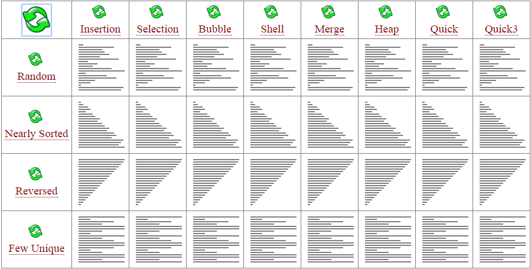

# 查找和排序专题

常用，因此罗列于此可以随时取用。

------

## 排序

### 10大经典排序算法

- [十大经典排序算法（动图演示） - 一像素 - 博客园 (cnblogs.com)](https://www.cnblogs.com/onepixel/articles/7674659.html)，动图很形象。
- [算法大总结之----10大经典排序算法(从小到大排列)_FrankJT的博客-CSDN博客_从小到大排序](https://blog.csdn.net/tjw316248269/article/details/105207710)，每一个都带示例代码。

各个排序算法动图



各个排序算法优劣


概念和原理 看上面的教程，下面是直接代码。

冒泡

```c
void BubbleSort(int arr[], int n)
{
    for (int i = 0; i < n - 1; i++)
    {
        for (int j = 0; j < n - i - 1; j++)
        {
            if (arr[j] > arr[j + 1]) /* 升序排序，若前一个大于后一个则交换 */
            {
                int temp = arr[j];
                arr[j] = arr[j + 1];
                arr[j + 1] = temp;
            }
        }
    }
}
```

选择 和 插入 排序记忆（时间复杂度都是 O(n^2)）：往后选择、往前插入；选择排序：在后面的 未排序的 里面 选择 找最大或最小的 往前放；插入排序：在后面的 未排序的 里面 依次地 往前 插入 到 正确的位置上，插入的遍历是 从近到远。希尔排序 就是 插入排序 的 插入 环节 是 从远到近 进行遍历，时间复杂度 O(n^1.3)。


### C 的 stdlib.h 的 qsort()

- [C 库函数 – qsort() | 菜鸟教程 (runoob.com)](https://www.runoob.com/cprogramming/c-function-qsort.html)。
- [stdlib.h/查找和排序函数/qsort.md · 宅学部落-开源仓库/C标准库函数新编手册 - 码云 - 开源中国 (gitee.com)](https://gitee.com/zhaixuebuluo/glibc_man_cn/blob/master/stdlib.h/查找和排序函数/qsort.md)。
- [ qsort函数、sort函数 (精心整理篇)_weixin_30363509的博客-CSDN博客](https://blog.csdn.net/weixin_30363509/article/details/98089916)。
- [sort()函数与qsort()函数及其用法_iteye_11341的博客-CSDN博客](https://blog.csdn.net/iteye_11341/article/details/82140691)。

```c
#include <stdlib.h>

void qsort(void *base, size_t nmemb, size_t size,
           int (*compar)(const void *, const void *));
/*
    base -- 指向要排序的数组的第一个元素的指针。
    nitems -- 由 base 指向的数组中元素的个数。
    size -- 数组中每个元素的大小，以字节为单位。
    compar -- 用来比较两个元素的函数：
    	若要升序排序（从小到大）就按下面这个设定写，若降序则相反
    	第1个参数 > 第2个参数 返回大于0的整数
        第1个参数 = 第2个参数 返回整数0
        第1个参数 < 第2个参数 返回小于0的整数
      自己写 compar 比较规则，则可以对 char/int/double 等类型排序，还可以对 结构体数组（根据其某个成员值来）、字符串数组 进行排序；
      只能对连续内存的数据进行排序，像链表这样的结构是无法排序的。
*/

/* 例子，引用 */
#include <stdio.h>
#include <stdlib.h> /* qsort */
#include <limits.h>
int compare_ints(const void* a, const void* b) /* 这是实现是 升序 排序 */
{
    int arg1 = *(int*)a;
    int arg2 = *(int*)b;
 
    if (arg1 > arg2) return 1;
    if (arg1 < arg2) return -1;
    return 0;
    
    或者可以这样写：
	
    return ( (*(int*)a) > (*(int*)b) ) ? 1 : -1;
    
    或者可以写成：（考虑“计算”应该比“比较”要慢）
    
    return ( (*(int*)a) - (*(int*)b) );
}
 
int main(void)
{
    int ints[] = { -2, 99, 0, -743, 2, INT_MIN, 4 };
    int size = sizeof ints / sizeof *ints; /* 数组 成员 个数 */
 
    qsort(ints, size, sizeof(int), compare_ints);
 
    for (int i = 0; i < size; i++) {
        printf("%d ", ints[i]);
    }
 
    printf("\n");
    
    /* 执行结果：
    	-2147483648 -743 -2 0 2 4 99
    */
}
```

### C++ 的 sort()

引自 [算法大总结之----10大经典排序算法(从小到大排列)_FrankJT的博客-CSDN博客_从小到大排序](https://blog.csdn.net/tjw316248269/article/details/105207710#21_csort_310)。

```c
/* 简单版本的定义：sort(begin, end, cmp)
参数：

_First(start)：起始元素指针位置
_Last(end)：终止元素指针位置
_Pr_pred(cmp)：排序规则，这是函数指针，回调函数的简单运用

下面对结构体 降序 排序例子 */

#include <iostream>
#include <algorithm>
#include <time.h>
using namespace std;

typedef struct _stu
{
	int age;
	string name;
}stu;

bool cmp(stu a, stu b)
{
	return a.age < b.age;
}

int main()
{
	stu student[10];
	for (int i = 0; i < 10; i++)
	{
		srand(i);  //随机数种子
		student[i].age = rand() % 20;  //生成不大于20的随机数
		student[i].name = "LiLei";
	}
	for (int i = 0; i < 10; i++)
	{
		cout << "The " << i << "th student age=" << student[i].age << " name=" << student[i].name << endl;
	}
	sort(student, student + 10, cmp);
	//student是结构体其实元素指针位置，student + 10是终止元素位置
	cout << "*********************************" << endl;
	for (int i = 0; i < 10; i++)
	{
		cout << "The " << i << "th student age=" << student[i].age << " name=" << student[i].name << endl;
	}
	return 0;
}

```


## 查找

### 串的快速模式匹配算法-KMP算法

主要思想就是相比于 BF 算法，为了加速匹配，找一些规律，当匹配失效的时候 j 不用每次回到 P 的 开头位置，而是根据（注意，不了解的推荐先看下面给出的教程文章，这里是明白后的总结） 模式串的 各个字串的 各个前缀、后缀子串的 最大公共元素长度 来构造 next 数组，j 每次移动的位数根据 next 来调整。

- [从头到尾彻底理解KMP - Chris_z - 博客园 (cnblogs.com)](https://www.cnblogs.com/zhangtianq/p/5839909.html)。[Coding-Zuo (cnblogs.com)](https://www.cnblogs.com/zzuuoo666/p/9028287.html)。该文讲的很清楚。
- [「天勤公开课」KMP算法易懂版_ 哔哩哔哩 _bilibili](https://www.bilibili.com/video/BV1jb411V78H)。

### 二分查找/C 的 stdlib.h 的 bsearch()

- [C 库函数 – bsearch() | 菜鸟教程 (runoob.com)](https://www.runoob.com/cprogramming/c-function-bsearch.html)。
- [stdlib.h/查找和排序函数/bsearch.md · 宅学部落-开源仓库/C标准库函数新编手册 - 码云 - 开源中国 (gitee.com)](https://gitee.com/zhaixuebuluo/glibc_man_cn/blob/master/stdlib.h/查找和排序函数/bsearch.md)。

```c
#include <stdlib.h>

void *bsearch(const void *key, const void *base,
              size_t nmemb, size_t size,
              int (*compar)(const void *, const void *));
/*
	bsearch() 对 nitems 对象的数组执行二分查找，base 指向进行查找的数组，key 指向要查找的元素，size 指定数组中每个元素的大小。

    key -- 指向要查找的元素的指针，类型转换为 void*。
    base -- 指向进行查找的数组的第一个对象的指针，类型转换为 void*。
    nitems -- base 所指向的数组中元素的个数。
    size -- 数组中每个元素的大小，以字节为单位。
    compar -- 用来比较两个元素的函数。
    
    函数返回值
        成功时，返回指向要查找到的元素指针。
        失败时，返回空指针。
*/

/* 例子，引用 */
#include <stdlib.h>
#include <stdio.h>

struct data {
    int nr;
    char const *value;
} dat[] = {
    {1, "Foo"}, {2, "Bar"}, {3, "Hello"}, {4, "World"}
};

int data_cmp(void const *lhs, void const *rhs) 
{
    struct data const *const l = lhs;
    struct data const *const r = rhs;
 
    if (l->nr < r->nr) return -1;
    else if (l->nr > r->nr) return 1;
    else return 0;
}

int main(void) 
{
    struct data key = { .nr = 3 };
    struct data const *res = bsearch(&key, dat, sizeof dat / sizeof dat[0],
                                     sizeof dat[0], data_cmp);
    if (res) {
        printf("No %d: %s\n", res->nr, res->value);
    } else {
        printf("No %d not found\n", key.nr);
    }
    
    /* 执行结果：
    	No 3: Hello
    */
}
```

